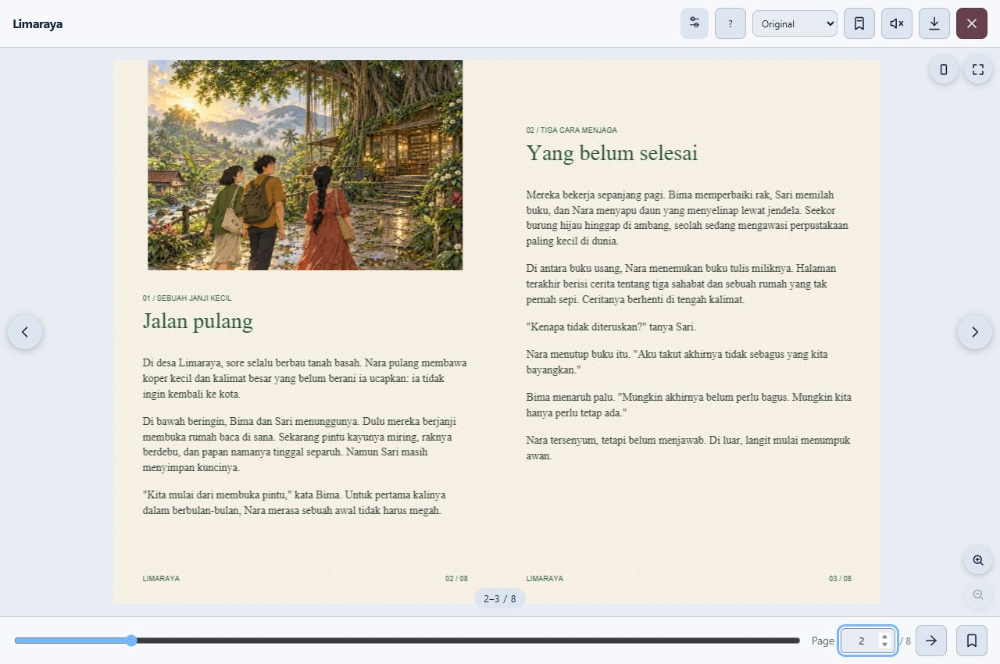

<p align="center"></p>

# Sela 📖

**Ceritamu. Ritme bacamu.** Reader web ringan dengan book flip, manga kanan ke kiri, webtoon tanpa jarak, dan mode satu halaman.

[English](README.md) · [Demo interaktif](https://bobbyfch.github.io/flippypdf/) · [Integrasi](docs/integrations.md) · [Format & batasan](docs/formats.md)

[](https://bobbyfch.github.io/flippypdf/)

## ✨ Yang tersedia

- PDF dengan PDF.js yang baru dimuat saat diperlukan.
- EPUB berupa teks mengalir, bisa diseleksi, navigasi bab dan ukuran teks.
- CBZ berisi gambar komik; DjVu melalui decoder eksternal opsional.
- Zoom tombol, Ctrl + roda mouse, pinch trackpad/touch; zoom roda biasa bisa diaktifkan.
- Webtoon tanpa jarak, lipatan dengan easing halus, tekstur kertas opsional.
- Bookmark, progres tersimpan, filter warna, light/dark/system, reduced motion.
- Playground untuk mengganti parameter sebelum dan saat membaca.

Tanpa Bootstrap, jQuery, atau icon font wajib. Interface sekitar **22,6 KiB gzip**; adapter EPUB/CBZ sekitar **6,8 KiB gzip**, dimuat terpisah. PDF.js + worker modern menambah sekitar **491 KiB gzip**, belum termasuk font/CMap bila diperlukan. Ukuran total tetap mengikuti renderer dan dokumen yang digunakan.

## 🚀 Pasang

```html
<script src="https://cdn.jsdelivr.net/gh/bobbyfch/flippypdf@v3.0.0/dist/js/sela.min.js"></script>
<button id="baca">Baca cerita</button>
<script>
const reader = new Sela({
  url: '/buku/cerita.pdf', mode: 'webtoon', pageGap: 0,
  theme: 'auto', paperTexture: true
});
document.querySelector('#baca').onclick = () => reader.open().catch(console.error);
</script>
```

CSS otomatis dimuat. URL berakhiran `.epub`, `.cbz`, `.djvu` dikenali otomatis; URL Blob, endpoint tanpa ekstensi dan byte data perlu `format` eksplisit. DjVu perlu `djvujsSrc` dari decoder GPL-2.0 yang kamu sediakan terpisah. EPUB tidak mendukung DRM, CSS penerbit atau fixed layout; CBZ mendukung gambar raster. Detail ada di [panduan format](docs/formats.md).

Gunakan `language: 'en'` untuk kontrol bahasa Inggris atau `'id'` untuk Indonesia (default). Pada Pages pilih bahasa melalui bendera. `paperTexture` berlaku pada permukaan book; zoom EPUB mengubah ukuran teks. PDF belum memiliki seleksi teks, pencarian atau anotasi. CBR/RAR, MOBI/AZW dan DOCX belum didukung.

CI3, Laravel, Vue, React, Svelte, Angular, Astro, TypeScript dan HTML biasa punya [contoh integrasi](docs/integrations.md). Bootstrap/Tailwind tetap boleh digunakan aplikasi. CDN lama dan tag historis dipertahankan; pin versi untuk produksi.

## ⌨️ Shortcut

| Tombol | Fungsi |
| --- | --- |
| Panah / Page Up / Page Down | Pindah halaman atau bab; manga mengikuti RTL |
| Home / End | Awal / akhir |
| + / − / 0 | Perbesar / perkecil / reset |
| F / B / M | Fullscreen / bookmark / suara |
| ? / Escape | Bantuan / tutup bantuan atau reader |

File yang dipilih di demo diproses di browser tanpa diunggah. Progress/bookmark memakai localStorage bila tersedia. Browser lama mendapat jalur PDF asli melalui compatibility entry, bukan seluruh fitur modern. Pengujian memakai Edge/Chromium dan emulasi viewport mobile; belum menguji semua perangkat fisik.

MIT untuk Sela, PDFlipbook dan fflate; PDF.js Apache-2.0. Decoder DjVu eksternal GPL-2.0 tidak dibundel. [Lisensi pihak ketiga](THIRD_PARTY_NOTICES.md).

Kalau membantu proyekmu, ⭐ memudahkan orang lain menemukannya. Untuk laporan bug, sertakan contoh dokumen, browser, mode, dan langkah reproduksi.

## 🌱 Arah berikutnya

[Riset dan roadmap](docs/roadmap.md) · [Panduan kontribusi](CONTRIBUTING.md)

Prioritas yang diusulkan: pencarian dan teks PDF yang aksesibel, navigasi EPUB lebih lengkap, fokus panel komik, lalu anotasi yang bisa diekspor. Semua masih rencana, bukan fitur yang sudah dirilis. Instalasi npm registry juga belum tersedia; saat ini gunakan CDN, GitHub atau self-hosted assets.

## Di antara waktu, di dalam cerita

**Sela** adalah jeda yang tak kosong: tempat halaman membuka jalan, dan cerita menemukan pulang. Nama baru ini menggantikan FlippyPDF; alamat repo dan CDN lama dipertahankan agar integrasi tetap berjalan. `Sela` dan `Flippy` memakai constructor yang sama.

### Fitur v3

- Daftar isi/penanda bawaan PDF dan EPUB, termasuk navigasi NCX serta tautan jangkar.
- Pencarian teks dan transkrip yang dapat dipilih; PDF pindai dan komik perlu OCR dari luar.
- TTS dari suara browser/OS, tanpa API berbayar atau model besar. Suara lokal diprioritaskan; suara daring harus dipilih secara sadar. Suara Indonesia dan perilaku jeda/latar bergantung pada perangkat.
- Catatan per halaman/bab dan ekspor/impor JSON untuk catatan serta bookmark pribadi.
- TXT, Markdown dasar, HTML aman dan FB2 berbasis teks; format ini memakai modul kecil terpisah.
- Rak buku lokal IndexedDB dan persiapan offline. Simpan berkas asli karena penyimpanan browser dapat terhapus.
- Paket extension Chromium dan Firefox untuk pengujian lokal, belum dipublikasikan di store.
- Mode otomatis satu halaman dalam portrait; tombol putar layar hanya bekerja jika browser/device mengizinkan.

Modul alat baca sekitar **4 KiB gzip**, adapter teks sekitar **2,5 KiB gzip**. Keduanya dimuat saat diperlukan. Beban mesin PDF dan berkas buku dihitung terpisah.

Web publik memilih bahasa berdasarkan negara IP melalui country.is pada kunjungan pertama; pilihan manual tersimpan selalu didahulukan. Negara Indonesia memakai Indonesia, lainnya Inggris. Jika gagal, bahasa browser menjadi cadangan. Tambahkan `?geo=off` untuk menonaktifkan lookup; dokumen tidak pernah dikirim. Library embed tidak melakukan lookup IP.

[Panduan offline & extension](docs/offline-extension.md) · [Riset dan batas kemampuan](docs/roadmap.md) · [Panduan lengkap Inggris](README.md)
